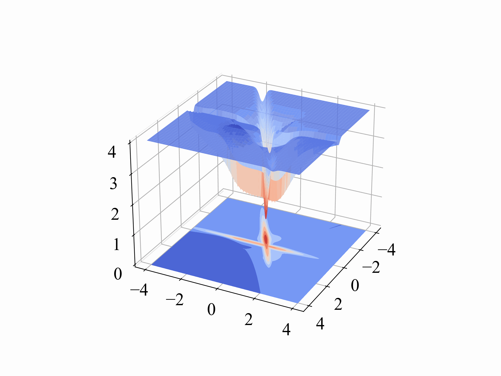
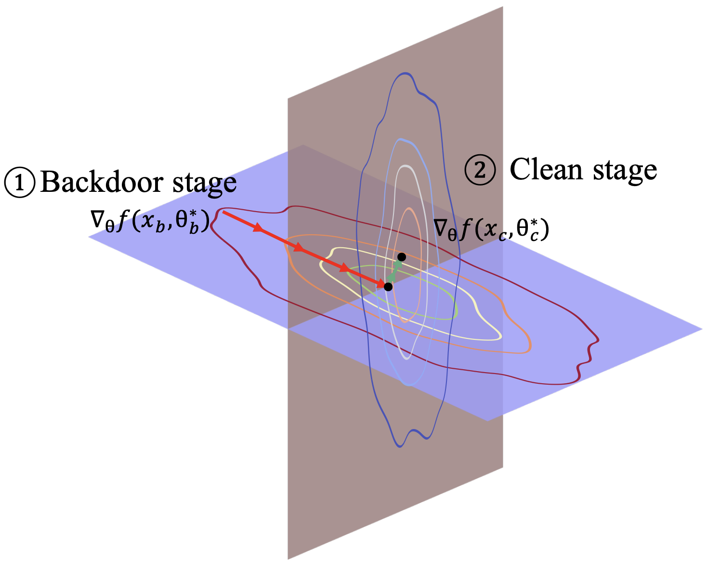
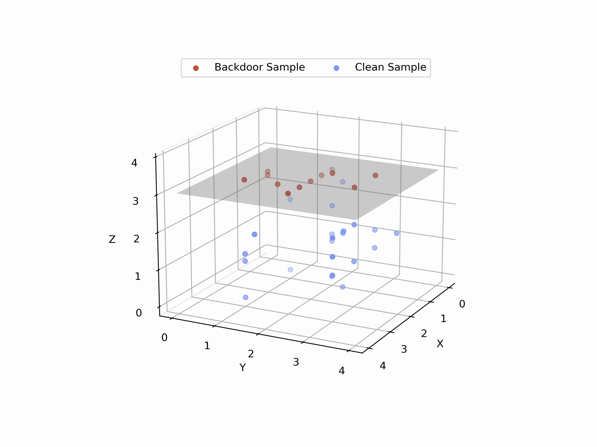
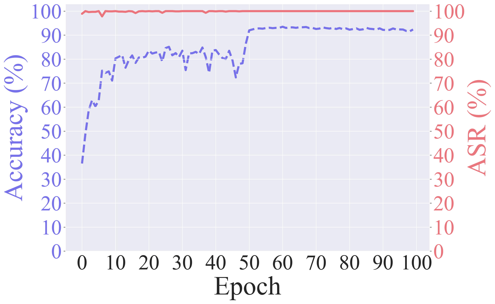
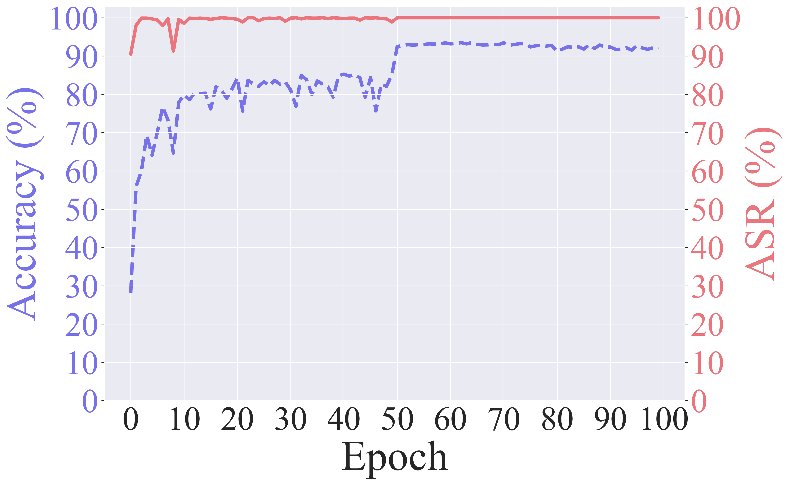
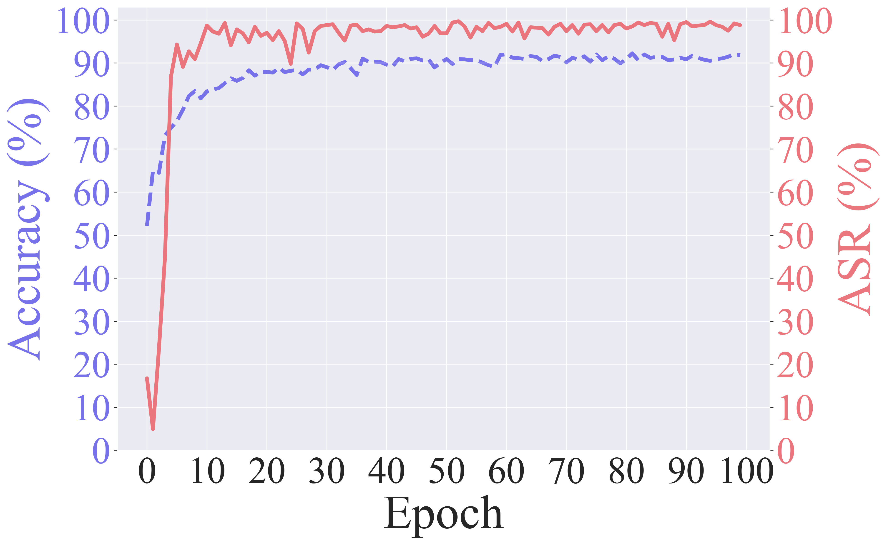

# Exploring the Orthogonality and Linearity of Backdoor Attacks (IEEE S&P 2024)


Table of Contents
=================
- [Overview](#Overview)
- [Code Architecture](#Code-Architecture)
- [Paper](./)
- [Requirements](#Requirements)
  - [Install required packages](#Install-required-packages)
- [Plot](#Plot)
- [Want to Evaluate Orthogonality and Linearity on Your Own Model?](#Want-to-Evaluate-Orthogonality-and-Linearity-on-Your-Own-Model)
  - [Evaluate Orthogonality](#Evaluate-Orthogonality)
  - [Evaluate Linearity](#Evaluate-Linearity)
- [Evaluation of Various Defense Methods Against Existing Attacks](#Evaluation-of-Various-Defense-Methods-Against-Existing-Attacks)
  - [How to Train the Model](#How-to-Train-the-Model)
  - [How to Run the Code](#How-to-Run-the-Code)
  - [Examples](#Examples)
- [Six Factors Impact the Orthogonality and Linearity of Backdoor Attacks](#Six-Factors-Impact-the-Orthogonality-and-Linearity-of-Backdoor-Attacks)
- [Citation](#Citation)
- [Special thanks to...](#Special-thanks-to)


## Overview
- This is the PyTorch implementation for IEEE S&P 2024 paper "[Exploring the Orthogonality and Linearity of Backdoor Attacks](./)".  
- **Key Observation**: Backdoor task is quickly learned much faster than the main task (clean).
- Take-Away: We theoretically formulate backdoor learning with two key
properties: **orthogonality** and **linearity**, and
in-depth explain how backdoors are learned by models.

<p align="center">
  <table>
    <tr>
      <td align="center"></td>
      <td align="center"></td>
      <td align="center"></td>
      <td align="center"></td>
    </tr>
  </table>
</p>

## Code Architecture  
    .
    ├── backdoors                       # different backdoor attacks
    ├── ckpt                            # pre-trained models
    ├── data                            # data directory
    │   └── triggers                    # trigger images / patterns
    ├── factors_variation               # evaluate the six factors that impact the orthogonality and linearity of backdoor attacks
    ├── log                             # training logs
    ├── models                          # model structures for different datasets
    ├── plot                            # visualization of backdoor attacks training ASR and ACC
    ├── utils                           # utils / params for different datasets
    ├── eval_orthogonality.py           # evaluate the orthogonality of the model
    ├── eval_linearity.py               # evaluate the linearity of the model
    ├── model_train.py                  # train the model in `ckpt` from scratch
    ├── model_detection.py              # evaluate the model detection defense methods
    ├── backdoor_mitigation.py          # evaluate the backdoor mitigation defense methods
    ├── input_detection.py              # evaluate the input detection defense methods
    └── ...

## Requirements

- Python >= 3.7.13
- PyTorch >= 1.12.0
- TorchVision >= 0.13.0

### Install required packages
```bash
# Create python environment (optional)
conda env create -f environment.yml
conda activate orth
```

## Plot
In our paper, we formalize backdoor learning as a two-task continual learning problem: 1). an initial rapid learning phase of the backdoor task within a few training epochs, followed by 2). a subsequent phase of gradually learning over the clean task.

<p align="center">
  <table>
    <tr>
      <td align="center"><br>CIFAR10 Training with BadNet</td>
      <td align="center"><br>CIFAR10 Training with Blend</td>
      <td align="center"><br>CIFAR10 Training with WaNet</td>
    </tr>
  </table>
</p>

We provide the code to demonstrate the observation in the `plot` folder. You can run the following command to plot the results to observe 

```bash
python plot_training.py badnet
```

## Want to Evaluate Orthogonality and Linearity on Your Own Model?

There are two functions: `eval_orthogonal` and `eval_linear` in `eval_orthogonality.py` and `eval_linearity.py` respectively. You can use these functions to evaluate the orthogonality and linearity of your model.

### Evaluate Orthogonality
You can evaluate the orthogonality of your model by running the following command. You can also evaluate the orthogonality of your model at a specific epoch.
```python
CUDA_VISIBLE_DIVICES=0 python eval_orthogonality.py --attack badnet --dataset cifar10 --network resnet18 --suffix _epoch_10
CUDA_VISIBLE_DIVICES=0 python eval_orthogonality.py --attack badnet --dataset cifar10 --network resnet18
```
The suffix is optional. If you want to evaluate the orthogonality of the model at a specific epoch, you can add the suffix. For example, `--suffix _epoch_10` will evaluate the orthogonality of the model at epoch 10. If you do not specify the suffix, the code will evaluate the orthogonality of the model at the last epoch.

### Evaluate Linearity
You can evaluate the linearity of your model by running the following command. You can also evaluate the linearity of your model. 
```python
CUDA_VISIBLE_DIVICES=0 python eval_linearity.py --attack badnet --dataset cifar10 --network resnet18 --suffix _epoch_10
CUDA_VISIBLE_DIVICES=0 python eval_linearity.py --attack badnet --dataset cifar10 --network resnet18
```
The suffix is optional. If you want to evaluate the linearity of the model at a specific epoch, you can add the suffix. For example, `--suffix _epoch_10` will evaluate the linearity of the model at epoch 10. If you do not specify the suffix, the code will evaluate the linearity of the model at the last epoch.

##  Evaluation of Various Defense Methods Against Existing Attacks

### How to Train the Model
We provide the necesarry ckpts in the `ckpt` folder. If you want to train the model from scratch, you can run the following command.

```bash
CUDA_VISIBLE_DEVICES=0 python model_train.py --dataset ${dataset} --network ${network} --phase xx
```

The `--phase` can be `train` or `test` or `poison`. The `--dataset` can be `cifar10` or `gtsrb`. The `--network` can be `resnet18` (in `cifar10`), and `wrn` (in `gtsrb`).


### How to Run the Code
We evaluate on 14 attacks and 12 defenses. We divide the 12 defenses into three categories: Model Detection (`model_detection` folder), Backdoor Mitigation (`backdoor_mitigation` folder) and Input Detection (`input_detection` folder). You can run the code as following.

```bash
CUDA_VISIBLE_DEVICES=0 python xx.py --dataset ${dataset} --network ${network} --phase ${phase} --attack ${attack}
```

In the above commond line, `xx.py` can be `model_detection.py ` or `backdoor_mitigation.py` or `input_detection.py`; `--dataset`: `cifar10` or `gtsrb`; `--network`: `resnet18` (in `cifar10`), and `wrn` (in `gtsrb`); `--phase` can be `nc, pixel, abs, fineprune, nad, anp, seam, ac, ss, spectre, scan`; `--attack` can be `clean badnet trojnn dynamic inputaware reflection blend sig filter dfst wanet invisible lira composite`

### Examples

1. Model Detection

    Take `cifar10` as an example, you can run  as the following command to evaluate the defense methods `nc` (in `model_detection` category) against the `badnet` attack:
    ```bash
    CUDA_VISIBLE_DEVICES=0 python model_detection.py --dataset cifar10 --network resnet18 --phase nc --attack badnet
    ```

2. Backdoor Mitigation

    Take `cifar10` as an example, you can run  as the following command to evaluate the defense methods `fineprune` (in `backdoor_mitigation` category) against the `badnet` attack:
    ```bash
    CUDA_VISIBLE_DEVICES=0 python backdoor_mitigation.py --dataset cifar10 --network resnet18 --phase fineprune --attack badnet
    ```

    `Selective Amnesia: On Efficient, High-Fidelity and Blind Suppression of Backdoor Effects in Trojaned Machine Learning Models` runs as the following command:
    ```bash
    CUDA_VISIBLE_DEVICES=0 python seam.py --dataset cifar10 --network resnet18 --attack badnet
    ```


3. Input Detection

    Take `cifar10` as an example, you can run  as the following command to evaluate the defense methods `scan` (in `input_detection` category) against the `badnet` attack:
    ```bash
    CUDA_VISIBLE_DEVICES=0 python input_detection.py --dataset cifar10 --network resnet18 --phase scan --attack badnet
    ```


## Six Factors Impact the Orthogonality and Linearity of Backdoor Attacks
We provide the code to evaluate the six factors that impact the orthogonality and linearity of backdoor attacks in the `factors_variation` folder. You can run the following command to evaluate the six factors.


### How to Run the Code
```bash
cd factors_variation

CUDA_VISIBLE_DEVICES=0 python eval_factors.py --phase poison --attack badnet --troj_type xx --troj_param 0.1
```
In the above command line, the `--troj_type` can be `'univ-rate', 'low-conf', 'label-spec', 'trig-focus', 'acti-sep', 'weig-cal'`, you can also change the `--troj_param` to evaluate the impact of different parameters.

### `univ-rate` example
  ```bash
  cd factors_variation
  
  CUDA_VISIBLE_DEVICES=0 python eval_factors.py --phase poison --attack badnet --troj_type univ-rate --troj_param 0.1
  ```

## Citation
Please cite our work as follows for any purpose of usage.
```bibtex
@inproceedings{zhang2024exploring,
  title={Exploring the Orthogonality and Linearity of Backdoor Attacks},
  author={Zhang, Kaiyuan and Cheng, Siyuan and Shen, Guangyu and Tao, Guanhong and An, Shengwei and Makur, Anuran and Ma, Shiqing and Zhang, Xiangyu},
  booktitle={2024 IEEE Symposium on Security and Privacy (SP)},
  pages={225--225},
  year={2024},
  url = {https://doi.ieeecomputersociety.org/10.1109/SP54263.2024.00182},
  organization={IEEE Computer Society}
}
```

# Special thanks to...
[](https://github.com/KaiyuanZh/OrthogLinearBackdoor/stargazers)
[](https://github.com/KaiyuanZh/OrthogLinearBackdoor/network/members)